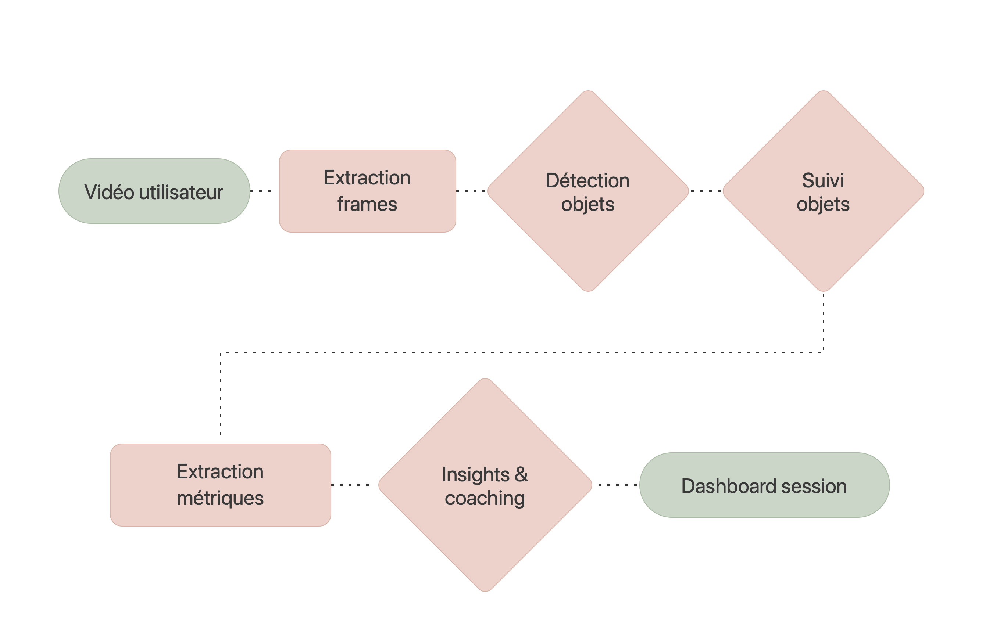

<div align="center">

# NextMove

**Analyse vidéo de sports de raquette par vision par ordinateur — insights, dashboards et recommandations de type coach.**

NextMove transforme de courtes vidéos de padel, pickleball et tennis en métriques compréhensibles et conseils d'amélioration. C'est **un projet** décliné sur **deux plateformes** : une **application iOS** native (SwiftUI + Core ML, inférence 100 % sur l'appareil) et une **application web** (Python / Streamlit) pour l'analyse de matchs, les dashboards de performance, la détection de patterns et le coaching IA. Les deux partagent les **mêmes modèles de vision par ordinateur finetunés**, la même logique produit, et le même compte utilisateur via une **API partagée**.

</div>

<p align="center">
  
</p>

<p align="center">
  <em>Détection et suivi en temps réel : chaque joueur reçoit un identifiant stable (player 1, player 2, ...), en plus de la balle et du terrain.</em><br>
  <sub>Clip complet : <a href="docs/media/demo_padel_nofield.mp4"><code>docs/media/demo_padel_nofield.mp4</code></a></sub>
</p>

---

## Vue d'ensemble

NextMove rend l'analyse de performance sportive accessible sans équipement spécialisé. À partir d'une simple vidéo filmée au téléphone, le système :

détecte les éléments clés du jeu — **joueurs, balle et terrain** ;<br>
suit ces objets dans le temps pour reconstruire la dynamique de l'échange ;<br>
calcule des métriques de positionnement et de déplacement ;<br>
reformule ces données en **insights lisibles** et en **recommandations de type coach** en langage naturel.

Trois sports sont pris en charge, chacun avec son propre modèle de détection entraîné : **padel**, **pickleball** et **tennis** (ce dernier servant aussi de modèle de repli pour le badminton).

<p align="center">
  
</p>

---

## Méthodologie

Le pipeline d'analyse s'articule en cinq étapes séquentielles, de la vidéo brute jusqu'au dashboard de session. Les deux plateformes suivent exactement les mêmes étapes ; seul le moteur d'exécution change (Core ML sur l'appareil pour iOS, Ultralytics YOLO côté serveur pour le web — cf. [Les deux plateformes](#les-deux-plateformes)).

<p align="center">
  
</p>

Le framework se compose de modules bien délimités :

**Module de détection**

Un modèle YOLO dédié par sport (même poids entraînés, exportés soit en Core ML pour iOS, soit exécutés directement via Ultralytics côté serveur).<br>
L'analyse se concentre sur les classes utiles au coaching : **`player`, `ball`**, et selon le sport un contexte de terrain (`field` pour le padel) ou d'équipement (`paddle` pour le pickleball).<br>
Le modèle padel sait aussi reconnaître `net`, `wall` et `outside-field`, mais ces classes sont filtrées pour ne conserver que l'essentiel du jeu.<br>
Padel : `player`, `ball`, `field` *(classes complémentaires : `net`, `wall`, `outside-field`)* — Pickleball : `player`, `ball`, `paddle` — Tennis : joueur et balle (repli badminton).<br>
Boîtes englobantes normalisées, filtrage par seuil de confiance (calibré par sport — la balle padel, petite et rapide, tolère un seuil plus bas), NMS intégré au modèle.<br>
**Réduction des faux positifs** : un seuil de confiance plus strict est appliqué aux joueurs, et toute boîte « joueur » située au-dessus du terrain (affiches, public, panneaux) ou de proportions non plausibles (plus large que haute) est écartée — un poster n'est jamais confondu avec un joueur.

**Module de suivi (tracking)**

Association détection-à-piste par IoU (avec repli sur la distance des centroïdes pour les mouvements rapides).<br>
**Chaque joueur reçoit un identifiant stable** (`player 1`, `player 2`, ...) conservé d'une frame à l'autre, avec une couleur dédiée — ce qui permet de suivre individuellement chaque joueur tout au long de l'échange.<br>
Ré-identification sur une fenêtre glissante pour gérer les occlusions courtes ; terminaison automatique des pistes.

**Module d'extraction de métriques**

Analyse de trajectoire de balle (direction, profondeur, vitesse estimée).<br>
Analyse des déplacements du joueur (couverture du terrain — enveloppe convexe des positions —, positionnement, vitesse).<br>
Détection de schémas de performance (positionnement statique, profondeur, déséquilibre de couverture, replacement).

**Module de coaching**

Priorisation des problèmes détectés par poids d'impact.<br>
Génération de retours en langage clair, avec suggestions d'entraînement et conseils rapides.<br>
Enrichissement optionnel par un LLM (langage plus naturel et contextualisé, ancré sur une base de connaissances d'exercices validés — RAG).

---

## Fonctionnalités

### Analyse vidéo
Import depuis la galerie ou enregistrement direct (iOS) / upload d'un fichier (web).<br>
Traitement de clips courts, préparés automatiquement pour l'analyse.

### Détection visuelle
Détection des joueurs et du contexte terrain.<br>
Détection de la balle lorsque les conditions le permettent.<br>
Identification de plusieurs éléments du jeu selon le sport.

### Génération d'insights
Durée et nombre d'échanges (rallies), à partir de la continuité de détection de la balle.<br>
Position moyenne et zones de couverture sur le terrain.<br>
Tendances de déplacement et patterns tactiques (zones à risque, phases de jeu dangereuses).

### Recommandations coach
Conseils actionnables : positionnement, déplacements, anticipation.<br>
Reformulation des métriques en langage simple (moteur de règles, enrichi par LLM si activé, ancré sur des exercices réels via RAG côté web).

### Dashboard de session
Résumé visuel : métriques clés, graphiques et recommandations principales.

### Compte partagé
Un même compte (email/mot de passe) fonctionne indifféremment sur iOS et sur le web : mêmes identifiants, mêmes matchs visibles des deux côtés (voir [API partagée](#-api-partagée-fastapi)).

---

## Les deux plateformes

Un seul projet NextMove, deux plateformes propulsées par les **mêmes modèles CV finetunés** (YOLO entraînés par sport), la même logique produit, et le **même compte utilisateur**. L'app iOS exécute l'inférence sur l'appareil ; l'app web offre la même expérience d'analyse de matchs, de dashboards et de coaching IA côté serveur.

### 📱 Application iOS (`nextmove/`)

Application native SwiftUI. L'ensemble de l'inférence vidéo s'exécute **sur l'appareil** — aucune vidéo n'est envoyée vers un serveur pour l'analyse. Seules l'authentification et la liste des matchs passent par l'API partagée.

| Composant | Rôle |
|-----------|------|
| `RootView` | Racine de l'app : bascule entre `LoginView` et `ContentView` selon l'état de connexion |
| `NextMoveAPI` | Client réseau de l'API partagée — login/register/me, liste des matchs |
| `LoginView` | Écran de connexion / inscription (compte partagé avec le web) |
| `VideoProcessor` | Extraction des frames via `AVAssetReader` |
| `ModelManager` | Chargement et mise en cache des modèles Core ML par sport |
| `ObjectDetector` | Inférence via le framework Vision (`VNCoreMLRequest`) |
| `ObjectTracker` | Suivi des objets entre frames (IoU + ré-identification) |
| `FeatureExtractor` | Calcul des métriques de performance |
| `CoachingEngine` / `EnhancedCoachingEngine` | Génération des retours (règles + LLM optionnel) |
| `AnalysisPipeline` | Orchestration des étapes avec suivi de progression |

**Stack :** Swift · SwiftUI · AVFoundation · Vision · Core ML · Swift Charts · SwiftData

### 🔌 API partagée (FastAPI)

Backend REST léger (`streamlit/src/api/`) exposant l'authentification et les données déjà gérées par l'app web à des clients externes — aujourd'hui l'app iOS. Il n'introduit aucune logique métier propre : il enveloppe les mêmes modules que l'app web utilise directement (`src/auth/`, `src/db/`), donc **un compte créé d'un côté fonctionne tel quel de l'autre**, et les matchs enregistrés sont visibles des deux côtés.

| Méthode | Route | Rôle |
|---------|-------|------|
| GET | `/health` | Sonde de disponibilité |
| POST | `/auth/register` | Créer un compte, renvoie un token JWT + l'utilisateur |
| POST | `/auth/login` | Se connecter, renvoie un token JWT + l'utilisateur |
| GET | `/auth/me` | Valider une session / récupérer l'utilisateur courant |
| GET | `/matches` | Lister les matchs de l'utilisateur connecté |

L'app web, elle, n'appelle pas cette API en HTTP : tournant déjà côté serveur, elle utilise directement `src/auth/` et `src/db/` — l'API existe spécifiquement pour donner ce même accès à un client externe comme iOS. Les deux émettent et valident le **même token JWT** (`src/auth/tokens.py`, signé avec `SECRET_KEY`), d'où l'interopérabilité des comptes.

Lancer l'API en local (depuis `streamlit/`, une fois les dépendances installées — voir plus bas) :

```bash
uvicorn src.api.main:app --reload --port 8000
```

Documentation interactive auto-générée : `http://localhost:8000/docs`. Détails et exemples `curl` : [`streamlit/src/api/README.md`](streamlit/src/api/README.md).

### 🌐 Application web (`streamlit/`)

Application web complète en **Python / Streamlit** dédiée à l'analyse de matchs multi-sport, aux dashboards de performance, à la détection de patterns de jeu et aux recommandations de coach IA. Elle s'appuie sur les **mêmes modèles de vision par ordinateur finetunés** que l'application iOS — exécutés ici côté serveur via [Ultralytics YOLO](https://github.com/ultralytics/ultralytics) (`src/services/cv_pipeline.py`), sans conversion Core ML — et constitue un produit autonome à part entière.

**Sports pris en charge :** Pickleball · Tennis · Padel.

#### Pages de l'application

L'app est organisée en pages accessibles depuis la barre latérale (`app.py`) :

| Page | Fichier | Rôle |
|------|---------|------|
| **Me** | `app.py` | Profil joueur, statistiques de progression, changement de sport |
| **Library** | `1_Library.py` | Liste des matchs analysés ou en attente d'analyse |
| **Upload** | `2_Upload.py` | Import d'une nouvelle vidéo, déclenche l'analyse CV |
| **Dashboard** | `3_Dashboard.py` | Métriques clés et visualisations du match sélectionné |
| **AI Analysis** | `4_AI_Analysis.py` | Rapport de coaching IA pour une action précise, par sport |
| **Patterns** | `5_Patterns.py` | Détection de tendances récurrentes dans le jeu |
| **Training Plan** | `6_Training_Plan.py` | Programme d'entraînement hebdomadaire personnalisé généré par l'agent IA |

#### Analyse vidéo côté serveur

Quand une vidéo est uploadée puis analysée (page *Upload*, bouton *Analyze Now*), `src/services/cv_pipeline.py` :

1. télécharge la vidéo depuis Supabase Storage ;
2. échantillonne des frames et fait tourner le modèle YOLO du sport (poids partagés avec iOS, `training/models/exported/`) ;
3. regroupe les frames en *rallies* (segments continus de présence de balle) ;
4. calcule la couverture de terrain (enveloppe convexe des positions joueurs) et classe la fin de chaque rally en *winner*/*error* selon l'accélération de la balle ;
5. persiste les événements bruts dans `match_events` et un résumé tactique (`src/patterns_engine.py`) dans `matches.patterns_summary`.

Si aucune balle n'est détectable (cadrage, luminosité, vidéo trop courte), une erreur explicite est renvoyée plutôt que des métriques inventées.

#### Coaching IA multi-sport (agents)

Chaque sport dispose de son propre agent de coaching sous `src/agents/` :

`agentpickelball/` — contexte, prompt et données d'exemple pour le pickleball.<br>
`agenttennis/` — équivalent pour le tennis.<br>
`agentpadel/` — équivalent pour le padel.<br>
`agentmanager/` — classe de base partagée (client Groq, base de connaissances RAG/ChromaDB).

Tous les agents renvoient le même schéma JSON (`constat`, `analyse`, `action_corrective`, `pro_tip`), affiché de façon identique dans l'UI Streamlit et en CLI via la méthode `Agent.afficher_rapport()`, héritée par les trois coachs. Chaque recommandation s'ancre sur des exercices réels retrouvés par recherche vectorielle dans une base de 50 exercices validés par sport (RAG), plutôt que sur des exercices inventés par le LLM. Une question libre posée au coach passe d'abord par un agent modérateur (`agentmoderator/`) qui filtre les tentatives de prompt injection.

#### Structure de l'application web

```
streamlit/
├── app.py                       # point d'entrée Streamlit (navigation + page "Me")
├── requirements.txt             # dépendances Python (versions pinnées)
├── alembic/                     # migrations de schéma (SQLAlchemy)
└── src/
    ├── config.py                 # variables d'environnement, clés API, chemins des prompts
    ├── design.py                 # thème / composants UI iOS-like
    ├── viz.py                    # visualisations (terrain tactique, etc.)
    ├── patterns_engine.py        # agrégation des patterns tactiques à partir des match_events
    ├── api/                      # backend FastAPI partagé avec iOS (voir ci-dessus)
    │   ├── main.py
    │   ├── routes_auth.py
    │   └── routes_matches.py
    ├── auth/                     # inscription/connexion, sessions, tokens JWT
    ├── db/                       # modèles SQLAlchemy (User, Match, MatchEvent, Analysis, TrainingPlan)
    ├── services/
    │   ├── cv_pipeline.py         # détection YOLO côté serveur (padel/pickleball/tennis)
    │   ├── match_service.py       # orchestration analyse + persistance match
    │   ├── analysis_service.py    # persistance des rapports de coaching IA
    │   ├── training_plan_service.py
    │   └── video_storage.py       # upload/lecture vidéo (Supabase Storage)
    ├── streamlit_app/             # pages de l'application
    │   ├── 1_Library.py
    │   ├── 2_Upload.py
    │   ├── 3_Dashboard.py
    │   ├── 4_AI_Analysis.py
    │   ├── 5_Patterns.py
    │   └── 6_Training_Plan.py
    └── agents/                    # agents de coaching IA (un par sport)
        ├── agentmanager/           # classe de base + RAG (ChromaDB)
        ├── agentmoderator/         # filtre anti prompt-injection
        ├── agentpickelball/
        ├── agenttennis/
        └── agentpadel/
```

Les poids de détection (`padel_best.pt`, `pickleball_best.pt`, `tennis_best.pt`) sont lus depuis `training/models/exported/` à la racine du dépôt (chemin surchargeable via `CV_WEIGHTS_DIR`), donc partagés avec l'app iOS sans être dupliqués.

#### Détails techniques

**Frontend / Backend :** Streamlit (Python) pour l'UI, FastAPI pour l'API partagée — les deux tournent sur la même base de code et la même base de données.<br>
**Vision par ordinateur :** Ultralytics YOLO (mêmes poids que l'app iOS) — détection joueurs/balle par échantillonnage de frames, cf. `src/services/cv_pipeline.py`.<br>
**Données :** Postgres (Supabase) via SQLAlchemy pour les comptes/matchs/événements ; vidéos dans un bucket Supabase Storage privé.<br>
**IA :** API Groq (modèles de type `llama-3.3-70b-versatile`) pour la génération des recommandations, avec base de connaissances RAG (ChromaDB + `sentence-transformers`) par sport.<br>
**Visualisation :** Plotly pour les graphiques et le terrain tactique (`src/viz.py`).

**Stack :** Python · Streamlit · FastAPI · Ultralytics YOLO · SQLAlchemy · Groq (LLM) · ChromaDB · Plotly

#### Prérequis (app web)

Python 3.10+<br>
Une base Postgres (Supabase recommandé) et un bucket Storage pour les vidéos.<br>
Une clé API Groq pour activer les recommandations IA *(optionnelle : sans clé, l'app bascule en mode démo)*.

#### Démarrage (app web)

```bash
cd streamlit
python -m venv .venv
source .venv/bin/activate        # macOS / Linux
# .venv\Scripts\Activate.ps1     # Windows
pip install -r requirements.txt
```

Créer un fichier `.env` à la racine du dépôt (voir `.env.example`) avec au minimum :

```env
GROQ_API_KEY=votre_cle_groq
MODEL_NAME_PICKELBALL=llama-3.3-70b-versatile
MODEL_NAME_TENNIS=llama-3.3-70b-versatile
MODEL_NAME_PADEL=llama-3.3-70b-versatile

DATABASE_URL=postgresql://...          # ou sqlite:///./nextmove_demo.db en local
SUPABASE_URL=https://xxxx.supabase.co
SUPABASE_SERVICE_KEY=...
SECRET_KEY=<python -c "import secrets; print(secrets.token_hex(32))">
```

Puis, depuis `streamlit/` :

```bash
streamlit run app.py                              # UI web, http://localhost:8501
uvicorn src.api.main:app --reload --port 8000      # API partagée (nécessaire pour l'app iOS)
```

> **Notes**
> - Sans `GROQ_API_KEY`, les pages *AI Analysis* et *Training Plan* affichent un rapport de démonstration statique.
> - Sans balle détectable dans la vidéo uploadée (cadrage, luminosité), l'analyse échoue avec un message explicite plutôt que d'inventer des métriques — réessayer avec une séquence plus claire.
> - Les vidéos importées via la page *Upload* sont stockées dans un bucket Supabase Storage privé (voir `src/services/video_storage.py`).

---

## Pipeline d'entraînement (`training/`)

Les modèles de détection sont entraînés **séparément en Python**, puis soit convertis au format Core ML pour l'application iOS, soit utilisés tels quels (`.pt`) par l'app web via Ultralytics. Aucune des deux applications n'entraîne de modèle : elles n'exécutent que l'inférence.

```
Vidéos → Extraction frames → Annotation → Entraînement YOLO → Conversion Core ML (iOS) / poids .pt (web)
```

**Étapes :**
1. Préparation et annotation des clips (`extract_frames.py`, `convert_annotations.py`, `split_dataset.py`, `validate_annotations.py`).
2. Entraînement du modèle (`train_yolo.py`, basé sur Ultralytics YOLO).
3. Évaluation des performances (`validate.py` — mAP, précision, rappel, vitesse).
4. Conversion vers Core ML avec quantification et NMS intégré (`convert_to_coreml.py`) pour iOS ; export direct `.pt` pour l'app web.
5. Intégration : dépôt du `.mlpackage` dans `nextmove/Models/<Sport>/` pour iOS, du `.pt` dans `training/models/exported/` pour le web (les deux lisent le même entraînement).

**Stack :** Python · PyTorch · Ultralytics YOLO · OpenCV · Core ML Tools

### Emplacement des modèles

| Sport | iOS (Core ML) | Web (`.pt`, Ultralytics) |
|-------|----------------|---------------------------|
| Pickleball | `nextmove/Models/Pickleball/PickleballDetector_v1.mlpackage` | `training/models/exported/pickleball_best.pt` |
| Padel | `nextmove/Models/Padel/PadelDetector_v1.mlpackage` | `training/models/exported/padel_best.pt` |
| Tennis (+ badminton) | `nextmove/Models/Tennis/TennisDetector_v1.mlpackage` | `training/models/exported/tennis_best.pt` |

`ModelManager` (iOS) et `cv_pipeline.py` (web) chargent chacun automatiquement le modèle correspondant au sport sélectionné ; aucune modification de code n'est nécessaire pour mettre à jour un modèle, il suffit de respecter le nom et l'emplacement.

---

## Prérequis

### Application iOS
macOS avec **Xcode** récent (projet créé avec Xcode 26).<br>
iOS 16 ou version ultérieure.<br>
Un appareil iOS compatible ou le simulateur.<br>
Les modèles Core ML intégrés au projet (voir tableau ci-dessus).<br>
L'API partagée lancée en local (ou une URL accessible) pour la connexion — voir [API partagée](#-api-partagée-fastapi).

### Application web
Voir [Prérequis (app web)](#prérequis-app-web) ci-dessus.

### Pipeline d'entraînement
Python 3.8+<br>
PyTorch 2.0+, Ultralytics YOLO 8.x, Core ML Tools 7.0+, OpenCV 4.8+<br>
GPU recommandé pour l'entraînement.

---

## Démarrage

### Application iOS

```bash
git clone https://github.com/Loulou441/nextmove.git
cd nextmove
open nextmove.xcodeproj
```

Puis, dans Xcode : sélectionner un simulateur (ex. iPhone 17) et lancer avec `⌘R`. L'API partagée (voir ci-dessous) doit tourner sur `http://localhost:8000` (simulateur) pour que l'écran de connexion fonctionne.

Au premier lancement, créer un compte ou se connecter, choisir un sport, importer ou enregistrer une vidéo, puis suivre la progression de l'analyse jusqu'au dashboard de coaching.

> **Coaching LLM (optionnel)** — ajoutez votre clé API dans un fichier `.env` pour activer l'enrichissement des retours par LLM. Sans clé, l'application bascule automatiquement sur le moteur de coaching basé sur des règles.

### Application web + API partagée

Voir [Démarrage (app web)](#démarrage-app-web) ci-dessus — en résumé, depuis `streamlit/` :

```bash
pip install -r requirements.txt
streamlit run app.py                              # http://localhost:8501
uvicorn src.api.main:app --reload --port 8000      # http://localhost:8000/docs
```

### Régénérer le clip de démonstration

Le clip ci-dessus a été produit en exécutant le modèle Core ML de padel sur une vidéo de match :

```bash
source training/venv/bin/activate
python training/scripts/render_demo_overlay.py \
  --model nextmove/Models/Padel/PadelDetector_v1.mlpackage \
  --video "/chemin/vers/votre_video.mp4" \
  --out docs/media/demo_padel.mp4 \
  --start 120 --duration 12 --conf 0.35
```

---

## Structure du dépôt

```
nextmove/
├── nextmove/               # Application iOS (SwiftUI + Core ML)
│   ├── Models/             # Modèles de données + modèles Core ML par sport
│   ├── Services/           # Détection, tracking, features, coaching, API, pipeline
│   ├── ViewModels/
│   └── Views/
├── nextmove.xcodeproj/     # Projet Xcode
├── nextmoveTests/          # Tests unitaires iOS
├── nextmoveUITests/        # Tests UI iOS
├── streamlit/              # Application web (Streamlit) + API partagée (FastAPI)
│   ├── app.py
│   ├── requirements.txt
│   ├── alembic/            # migrations de schéma
│   └── src/
│       ├── api/            # backend FastAPI (auth + matchs, partagé avec iOS)
│       ├── auth/ · db/ · services/ · agents/ · streamlit_app/
│       └── ...
├── training/               # Pipeline d'entraînement Python (YOLO → Core ML / .pt)
│   ├── scripts/
│   ├── configs/
│   └── models/exported/    # poids .pt utilisés par l'app web
├── docs/media/              # Média de démonstration (clip, GIF, images)
├── scripts/                 # Utilitaires (ex. test_db_connection.py)
├── USAGE_EXAMPLE_LLM.swift  # Exemple d'intégration du coaching LLM (iOS)
├── verify_llm_setup.sh      # Vérifie la config LLM iOS (.env, fichiers Swift attendus)
├── .env.example
└── README.md
```

---

## Licence

Ce projet est distribué sous licence MIT. Voir le fichier `LICENSE` pour plus d'informations.
