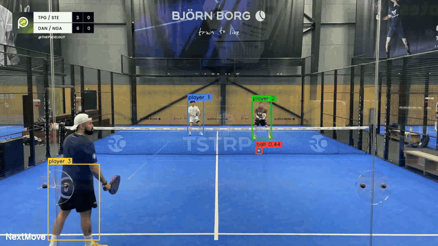
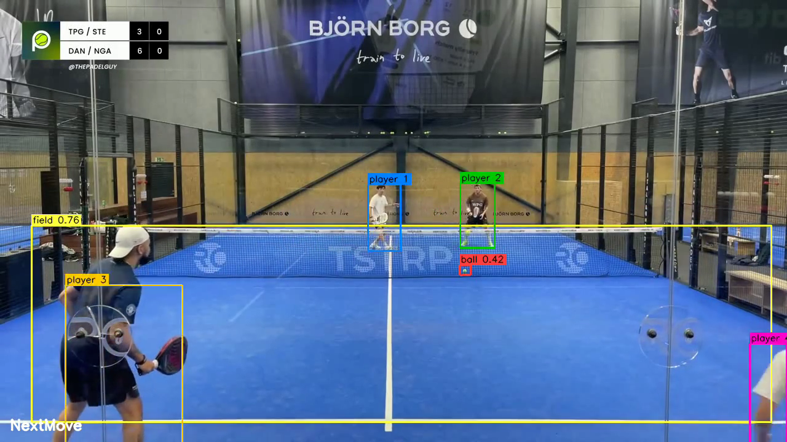

<div align="center">
<div align="center">

# NextMove

**Analyse vidéo de sports de raquette par vision par ordinateur — insights, dashboards et recommandations de type coach.**

NextMove transforme de courtes vidéos de padel, pickleball, tennis et football en métriques compréhensibles et conseils d'amélioration. Le projet regroupe **deux applications complètes et indépendantes**, construites sur les **mêmes modèles de vision par ordinateur finetunés** : une **application iOS** native (SwiftUI + Core ML, inférence 100 % sur l'appareil) et une **application web** (Python / Streamlit) pour l'analyse de matchs, les dashboards de performance, la détection de patterns et le coaching IA. Aucune n'est un simple complément de l'autre — ce sont deux produits à part entière qui exploitent la même base de modèles CV.

</div>

<p align="center">
  
</p>

<p align="center">
  <em>Détection et suivi en temps réel : chaque joueur reçoit un identifiant stable (player 1, player 2, ...), en plus de la balle et du terrain.</em><br>
  <sub>Clip complet : <a href="docs/media/demo_padel_nofield.mp4"><code>docs/media/demo_padel_nofield.mp4</code></a></sub>
</p>

---

## Vue d'ensemble

NextMove rend l'analyse de performance sportive accessible sans équipement spécialisé. À partir d'une simple vidéo filmée au téléphone, le système :

- détecte les éléments clés du jeu — **joueurs, balle et terrain** ;
- suit ces objets dans le temps pour reconstruire la dynamique de l'échange ;
- calcule des métriques de positionnement et de déplacement ;
- reformule ces données en **insights lisibles** et en **recommandations de type coach** en langage naturel.

Trois sports sont pris en charge, chacun avec son propre modèle de détection entraîné : **padel**, **pickleball** et **tennis** (ce dernier servant aussi de modèle de repli pour le badminton).

<p align="center">
  
</p>

---

## Méthodologie

Le pipeline d'analyse s'articule en cinq étapes séquentielles, de la vidéo brute jusqu'au dashboard de session.

```
Vidéo utilisateur
        │
        ▼
1. Extraction des frames          (AVFoundation / OpenCV)
        │
        ▼
2. Détection d'objets             (Core ML — modèle YOLO par sport)
        │
        ▼
3. Suivi des objets (tracking)    (association IoU + ré-identification)
        │
        ▼
4. Extraction de métriques        (trajectoires, couverture, positionnement)
        │
        ▼
5. Insights & recommandations     (moteur de coaching + LLM optionnel)
        │
        ▼
   Dashboard de session
```

Le framework se compose de modules bien délimités :

1. **Module de détection**
   - Un modèle YOLO dédié par sport, exporté au format Core ML.
   - L'analyse se concentre sur trois classes utiles au coaching : **`player`, `ball`, `field`**.
   - Le modèle padel sait aussi reconnaître `net`, `wall` et `outside-field`, mais ces classes sont filtrées pour ne conserver que l'essentiel du jeu :
     - **Padel** : `player`, `ball`, `field` *(classes complémentaires disponibles : `net`, `wall`, `outside-field`)*
     - **Pickleball** : `player`, `ball`, `paddle`
     - **Tennis** : joueur et balle (repli badminton)
   - Boîtes englobantes normalisées, filtrage par seuil de confiance, NMS intégré au modèle.
   - **Réduction des faux positifs** : un seuil de confiance plus strict est appliqué aux joueurs, et toute boîte « joueur » située au-dessus du terrain (affiches, public, panneaux) ou de proportions non plausibles (plus large que haute) est écartée — un poster n'est jamais confondu avec un joueur.

2. **Module de suivi (tracking)**
   - Association détection-à-piste par IoU (avec repli sur la distance des centroïdes pour les mouvements rapides).
   - **Chaque joueur reçoit un identifiant stable** (`player 1`, `player 2`, ...) conservé d'une frame à l'autre, avec une couleur dédiée — ce qui permet de suivre individuellement chaque joueur tout au long de l'échange.
   - Ré-identification sur une fenêtre glissante pour gérer les occlusions courtes ; terminaison automatique des pistes.

3. **Module d'extraction de métriques**
   - Analyse de trajectoire de balle (direction, profondeur, vitesse estimée).
   - Analyse des déplacements du joueur (couverture du terrain, positionnement, vitesse).
   - Détection de schémas de performance (positionnement statique, profondeur, déséquilibre de couverture, replacement).

4. **Module de coaching**
   - Priorisation des problèmes détectés par poids d'impact.
   - Génération de retours en langage clair, avec suggestions d'entraînement et conseils rapides.
   - Enrichissement optionnel par un LLM (langage plus naturel et contextualisé).

---

## Fonctionnalités

### Analyse vidéo
- Import depuis la galerie ou enregistrement direct.
- Traitement de clips courts, préparés automatiquement pour l'analyse.

### Détection visuelle
- Détection des joueurs et du contexte terrain.
- Détection de la balle lorsque les conditions le permettent.
- Identification de plusieurs éléments du jeu selon le sport.

### Génération d'insights
- Durée estimée des échanges.
- Position moyenne et zones de couverture sur le terrain.
- Tendances de déplacement.

### Recommandations coach
- Conseils actionnables : positionnement, déplacements, anticipation.
- Reformulation des métriques en langage simple (moteur de règles, enrichi par LLM si activé).

### Dashboard de session
- Résumé visuel : métriques clés, graphiques et recommandations principales.

---

## Les deux applications

NextMove se décline en **deux applications complètes**, toutes deux propulsées par les **mêmes modèles CV finetunés** (YOLO entraînés par sport). L'app iOS exécute l'inférence sur l'appareil ; l'app web offre une expérience d'analyse de matchs, de dashboards et de coaching IA côté serveur. Aucune n'est secondaire par rapport à l'autre.

### 📱 Application iOS (`nextmove/`)

Application native SwiftUI. L'ensemble de l'inférence s'exécute **sur l'appareil** — aucune vidéo n'est envoyée vers un serveur pour l'analyse.

| Composant | Rôle |
|-----------|------|
| `VideoProcessor` | Extraction des frames via `AVAssetReader` |
| `ModelManager` | Chargement et mise en cache des modèles Core ML par sport |
| `ObjectDetector` | Inférence via le framework Vision (`VNCoreMLRequest`) |
| `ObjectTracker` | Suivi des objets entre frames (IoU + ré-identification) |
| `FeatureExtractor` | Calcul des métriques de performance |
| `CoachingEngine` / `EnhancedCoachingEngine` | Génération des retours (règles + LLM optionnel) |
| `AnalysisPipeline` | Orchestration des étapes avec suivi de progression |

**Stack :** Swift · SwiftUI · AVFoundation · Vision · Core ML · Swift Charts · SwiftData

### 🌐 Application web (branche [`feature/rag`](https://github.com/Loulou441/nextmove/tree/feature/rag))

Application web complète en **Python / Streamlit** dédiée à l'analyse de matchs multi-sport, aux dashboards de performance, à la détection de patterns de jeu et aux recommandations de coach IA. Elle s'appuie sur les **mêmes modèles de vision par ordinateur finetunés** que l'application iOS et constitue un produit autonome à part entière.

**Sports pris en charge :** Pickleball · Football · Padel.

#### Pages de l'application

L'app est organisée en pages accessibles depuis la barre latérale (`app.py`) :

| Page | Fichier | Rôle |
|------|---------|------|
| **Me** | `app.py` | Profil joueur, statistiques de progression, changement de sport |
| **Library** | `1_Library.py` | Liste des matchs analysés ou en attente d'analyse |
| **Upload** | `2_Upload.py` | Import d'une nouvelle vidéo / d'un nouveau match |
| **Dashboard** | `3_Dashboard.py` | Métriques clés et visualisations du match sélectionné |
| **AI Analysis** | `4_AI_Analysis.py` | Rapport de coaching IA pour une action précise, par sport |
| **Patterns** | `5_Patterns.py` | Détection de tendances récurrentes dans le jeu |
| **Training Plan** | `6_Training_Plan.py` | Programme d'entraînement hebdomadaire personnalisé généré par l'agent IA |

#### Coaching IA multi-sport (agents)

Chaque sport dispose de son propre agent de coaching sous `src/agents/` :

- `agentpickelball/` — contexte, prompt et données d'exemple pour le pickleball.
- `agentfootball/` — équivalent pour le football.
- `agentpadel/` — équivalent pour le padel.
- `agentmanager/` — classe de base partagée (client Groq).

Tous les agents renvoient le même schéma JSON (`constat`, `analyse`, `action_corrective`, `pro_tip`), affiché de façon identique dans l'UI Streamlit et en CLI via la méthode `Agent.afficher_rapport()`, héritée par les trois coachs.

#### Structure de l'application web

```
nextmove/                       # (branche feature/rag)
├── app.py                      # point d'entrée Streamlit (navigation + page "Me")
├── requirements.txt            # dépendances Python (versions pinnées)
├── docs/
│   └── mockups/                # captures d'écran de référence (design)
├── data/
│   └── demo_games.csv          # jeu de données de démo
└── src/
    ├── config.py               # variables d'environnement, clés API, chemins des prompts
    ├── analysis_engine.py      # logique d'analyse des matchs
    ├── patterns_engine.py      # détection de patterns de jeu
    ├── design.py               # thème / composants UI iOS-like
    ├── viz.py                   # visualisations (terrain tactique, etc.)
    ├── streamlit_app/           # pages de l'application
    │   ├── 1_Library.py
    │   ├── 2_Upload.py
    │   ├── 3_Dashboard.py
    │   ├── 4_AI_Analysis.py
    │   ├── 5_Patterns.py
    │   └── 6_Training_Plan.py
    └── agents/                  # agents de coaching IA (un par sport)
        ├── agentmanager/
        ├── agentpickelball/
        ├── agentfootball/
        └── agentpadel/
```

#### Détails techniques

- **Frontend / Backend :** Streamlit (Python) — pas de séparation front/back, tout tourne dans le processus `streamlit run app.py`.
- **Données :** CSV de démo (`data/demo_games.csv`) et fichiers JSON d'exemple par sport.
- **IA :** API Groq (modèles de type `llama-3.3-70b-versatile`) pour la génération des recommandations.
- **Visualisation :** Plotly pour les graphiques et le terrain tactique (`src/viz.py`).

**Stack :** Python · Streamlit · Groq (LLM) · Plotly · Pandas

#### Prérequis (app web)

- Python 3.10+
- Une clé API Groq pour activer les recommandations IA *(optionnelle : sans clé, l'app bascule en mode démo)*.

#### Démarrage (app web)

```bash
git clone -b feature/rag https://github.com/Loulou441/nextmove.git
cd nextmove
python -m venv .venv
source .venv/bin/activate        # macOS / Linux
# .venv\Scripts\Activate.ps1     # Windows
pip install -r requirements.txt
```

Créer un fichier `.env` à la racine avec au minimum :

```env
GROQ_API_KEY=votre_cle_groq
MODEL_NAME_PICKELBALL=llama-3.3-70b-versatile
MODEL_NAME_FOOTBALL=llama-3.3-70b-versatile
MODEL_NAME_PADEL=llama-3.3-70b-versatile
```

Puis lancer l'application :

```bash
streamlit run app.py
```

> **Notes**
> - Sans `GROQ_API_KEY`, les pages *AI Analysis* et *Training Plan* affichent un rapport de démonstration statique.
> - Les vidéos importées via la page *Upload* sont stockées localement dans `data/videos/` (non versionné, voir `.gitignore`).
> - L'application web est maintenue dans la branche `feature/rag` du dépôt.

---

## Pipeline d'entraînement (`training/`)

Les modèles de détection sont entraînés **séparément en Python**, puis convertis au format Core ML pour l'application iOS. L'application n'entraîne aucun modèle : elle n'exécute que l'inférence.

```
Vidéos → Extraction frames → Annotation → Entraînement YOLO → Conversion Core ML → Intégration iOS
```

**Étapes :**
1. Préparation et annotation des clips (`extract_frames.py`, `convert_annotations.py`, `split_dataset.py`, `validate_annotations.py`).
2. Entraînement du modèle (`train_yolo.py`, basé sur Ultralytics YOLO).
3. Évaluation des performances (`validate.py` — mAP, précision, rappel, vitesse).
4. Conversion vers Core ML avec quantification et NMS intégré (`convert_to_coreml.py`).
5. Intégration : dépôt du `.mlpackage` dans le dossier du sport correspondant.

**Stack :** Python · PyTorch · Ultralytics YOLO · OpenCV · Core ML Tools

### Emplacement des modèles dans l'app iOS

| Sport | Dossier | Nom du fichier |
|-------|---------|----------------|
| Pickleball | `nextmove/Models/Pickleball/` | `PickleballDetector_v1.mlpackage` |
| Padel | `nextmove/Models/Padel/` | `PadelDetector_v1.mlpackage` |
| Tennis (+ badminton) | `nextmove/Models/Tennis/` | `TennisDetector_v1.mlpackage` |

`ModelManager` charge automatiquement le modèle correspondant au sport sélectionné ; aucune modification de code n'est nécessaire pour mettre à jour un modèle (il suffit de respecter le nom et le dossier).

---

## Prérequis

### Application iOS
- macOS avec **Xcode** récent (projet créé avec Xcode 26).
- iOS 16 ou version ultérieure.
- Un appareil iOS compatible ou le simulateur.
- Les modèles Core ML intégrés au projet (voir tableau ci-dessus).

### Pipeline d'entraînement
- Python 3.8+
- PyTorch 2.0+, Ultralytics YOLO 8.x, Core ML Tools 7.0+, OpenCV 4.8+
- GPU recommandé pour l'entraînement.

---

## Démarrage

### Application iOS

```bash
git clone https://github.com/Loulou441/nextmove.git
cd nextmove
open nextmove.xcodeproj
```

Puis, dans Xcode : sélectionner un simulateur (ex. iPhone 17) et lancer avec `⌘R`.
Au premier lancement, choisir un sport, importer ou enregistrer une vidéo, puis suivre la progression de l'analyse jusqu'au dashboard de coaching.

> **Coaching LLM (optionnel)** — ajoutez votre clé API dans un fichier `.env` pour activer l'enrichissement des retours par LLM. Sans clé, l'application bascule automatiquement sur le moteur de coaching basé sur des règles.

### Régénérer le clip de démonstration

Le clip ci-dessus a été produit en exécutant le modèle Core ML de padel sur une vidéo de match :

```bash
source training/venv/bin/activate
python training/scripts/render_demo_overlay.py \
  --model nextmove/Models/Padel/PadelDetector_v1.mlpackage \
  --video "/chemin/vers/votre_video.mp4" \
  --out docs/media/demo_padel.mp4 \
  --start 120 --duration 12 --conf 0.35
```

---

## Structure du dépôt

```
nextmove/
├── nextmove/              # Application iOS (SwiftUI + Core ML)
│   ├── Models/            # Modèles de données + modèles Core ML par sport
│   ├── Services/          # Détection, tracking, features, coaching, pipeline
│   ├── ViewModels/
│   └── Views/
├── nextmoveTests/         # Tests unitaires
├── training/              # Pipeline d'entraînement Python (YOLO → Core ML)
│   ├── scripts/
│   ├── configs/
│   └── ...
├── docs/media/            # Média de démonstration (clip, GIF, images)
└── README.md
```

---

## Licence

Ce projet est distribué sous licence MIT. Voir le fichier `LICENSE` pour plus d'informations.
