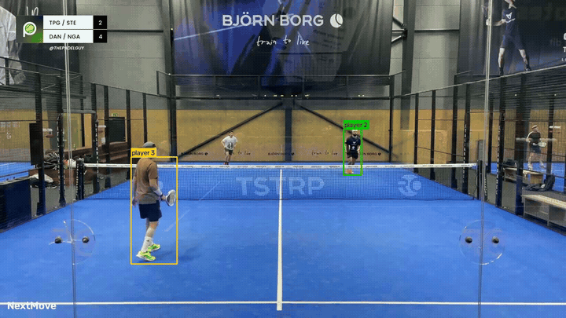

# NextMove

NextMove analyse des vidéos de sports de raquette pour produire des
indicateurs de performance et des recommandations de coaching.

Le projet couvre le padel, le pickleball et le tennis. Il propose trois
interfaces : une application mobile, une application Streamlit et une
application web React / Next.js.



## Les applications

| Application | Technologies | Analyse vidéo |
|---|---|---|
| Mobile | SwiftUI, AVFoundation, Vision, Core ML | Sur l’appareil |
| Streamlit | Python, Streamlit, SQLAlchemy | Côté serveur avec YOLO |
| Web | React, Next.js, TypeScript, FastAPI | Côté serveur avec YOLO |

Les applications partagent un objectif produit et des modèles issus du
pipeline d’entraînement. Leurs implémentations et leur couverture
fonctionnelle restent distinctes.

**Déploiement.** L’interface web est hébergée sur Vercel et l’API FastAPI
tourne dans un conteneur Docker sur une instance AWS EC2, avec Supabase pour la
base et le stockage des vidéos. L’image Docker contient `torch`, `ultralytics`
et Chromium : l’analyse vidéo web (`POST /matches/{id}/analyze`) et l’export PDF
sont donc disponibles en production. L’app mobile fait toujours sa vision par
ordinateur en local et envoie ses résultats à l’API. Voir
[backend/DEPLOY.md](backend/DEPLOY.md).

## Organisation du dépôt

| Dossier | Contenu |
|---|---|
| `ios/` | Application Swift, projet Xcode et tests |
| `streamlit/` | Application Streamlit, services Python et migrations |
| `web/frontend/` | Interface React / Next.js |
| `backend/` | API FastAPI commune à React et à l'application mobile, services et agents |
| `training/` | Préparation des données, entraînement, évaluation et export |
| `docs/` | Documentation, exemples, maquettes et médias |
| `scripts/` | Vérifications et maintenance |

Fichiers de configuration à la racine :

- `Dockerfile` et `.dockerignore` : image de l’API (voir [backend/DEPLOY.md](backend/DEPLOY.md)) ;
- `.env.example` : exemple pour le `.env` racine utilisé par Streamlit ;
- `backend/.env.example` : exemple pour `backend/.env`, utilisé par l’API ;
- `web/frontend/.env.local.example` : adresse publique de l’API pour le web ;
- `.gitignore` : exclusions Git ;
- `packages.txt` : dépendances système utilisées pour le déploiement Python ;
- `railway.json`, `nixpacks.toml`, `Procfile`, `requirements.txt` : anciennes
  configurations de déploiement sur Railway, conservées pour mémoire et non utilisées
  par le déploiement actuel (Vercel et AWS EC2).

## Démarrage rapide

### Web React / Next.js

Lancer le backend Python et le frontend dans deux terminaux.

Les commandes, variables d’environnement et vérifications sont détaillées
dans [web/README.md](web/README.md).

### Application mobile

Depuis la racine :

```bash
open ios/nextmove.xcodeproj
```

Voir [ios/README.md](ios/README.md) pour les prérequis, la connexion à l’API
et la configuration du coaching.

### Streamlit

L’application est accessible en ligne :
**[Ouvrir NextMove Streamlit](https://nextmove-app.streamlit.app/)**.

Aucune installation locale n’est nécessaire pour l’utiliser. Son code reste
dans `streamlit/` ; elle appelle directement ses services Python.
Son déploiement n’héberge pas automatiquement l’API FastAPI.

Voir [streamlit/README.md](streamlit/README.md) pour son organisation et sa configuration.

## API et données

Une seule API HTTP est conservée, dans `backend/`, pour React et l'application mobile.
Depuis la racine du dépôt, après installation et configuration :

```bash
python -m uvicorn backend.api.main:app --reload --port 8000
```

Voir [backend/README.md](backend/README.md) pour la configuration et le passage
depuis l’ancienne organisation. L’ancien dossier `streamlit/src/api/` a été retiré.

React utilise `NEXT_PUBLIC_API_URL`. L'application mobile utilise `NEXTMOVE_API_URL`, avec
`http://localhost:8000` par défaut pour le simulateur. L’API se déploie séparément
de l’interface Streamlit, dans un conteneur Docker (voir [backend/DEPLOY.md](backend/DEPLOY.md)).

Les comptes web demandent une confirmation d’adresse email (code à six chiffres envoyé
par Resend) et proposent la réinitialisation du mot de passe. Cela nécessite la variable
`RESEND_API_KEY` côté API.

Streamlit conserve ses services, son authentification et ses accès SQL.
Pour partager les comptes et accepter les tokens existants, configurer la même
base et la même `SECRET_KEY` côté Streamlit et backend.
Les vidéos et analyses mobiles restent locales : ce déplacement n’ajoute pas de
synchronisation complète de sa bibliothèque et ne modifie pas son pipeline Core ML.

## Base de données et migrations

Les migrations historiques restent dans `streamlit/alembic/versions/`.
La configuration du backend les réutilise et ajoute les nouvelles révisions,
dont la table des conversations du coach.

Depuis la racine, avec l’environnement Python du backend activé :

```bash
python -m alembic -c backend/alembic.ini current
python -m alembic -c backend/alembic.ini upgrade head
```

La priorité de `DATABASE_URL` est : environnement du processus, `backend/.env`,
puis `.env` racine. Vérifier la base ciblée et sauvegarder les données avant
une mise à niveau. Pour une base partagée avec Streamlit, utiliser cette
configuration commune. Les cas de bases initialisées sans Alembic ou issues
de l’ancienne branche web sont décrits dans [le guide des migrations](backend/alembic/README).

Les fichiers `.env` et les clés privées ne doivent pas être versionnés.

## Modèles de vision

| Sport | Mobile — Core ML | Python — YOLO |
|---|---|---|
| Padel | `ios/nextmove/Models/Padel/PadelDetector_v1.mlpackage` | `training/models/exported/padel_best.pt` |
| Pickleball | `ios/nextmove/Models/Pickleball/PickleballDetector_v1.mlpackage` | `training/models/exported/pickleball_best.pt` |
| Tennis | `ios/nextmove/Models/Tennis/TennisDetector_v1.mlpackage` | `training/models/exported/tennis_best.pt` |

Les deux pipelines Python recherchent par défaut les poids dans
`training/models/exported/`. La variable `CV_WEIGHTS_DIR` permet de choisir
un autre dossier ; utiliser de préférence un chemin absolu.

Les modèles Core ML sont des exports adaptés à l’application Apple.

Le code de l'application mobile mentionne également le badminton avec un repli sur le modèle
tennis. Aucun modèle badminton dédié n’est fourni.

## Entraînement

Le dossier `training/` contient :

- les configurations des sports dans `configs/` ;
- les scripts de préparation, d’entraînement et de validation ;
- les outils de conversion vers Core ML ;
- les notebooks Kaggle ;
- les poids exportés.

Les dépendances d’entraînement sont dans `training/requirements.txt`.
Utiliser un environnement Python séparé de celui des applications.

## Vérifications

Vérifier les fichiers et branchements du coaching mobile :

```bash
bash scripts/verify_llm_setup.sh
```

Ce script effectue des contrôles statiques. Il ne compile pas l’application
et ne valide pas les appels au fournisseur LLM.

Avant une fusion :

1. Compiler et tester l'application mobile dans Xcode si la partie Apple est concernée.
2. Vérifier le démarrage de l’interface et de l’API concernées.
3. Tester la connexion, l’import vidéo et l’analyse.
4. Vérifier les résultats et les fonctionnalités de coaching.
5. Pour le frontend web, exécuter `npm run lint` et `npm run build`.
6. Pour l’API, exécuter `python -m pytest backend/tests -q` (voir [backend/README.md](backend/README.md)).

## Documentation

- [Application web](web/README.md)
- [Application mobile](ios/README.md)
- [Application Streamlit](streamlit/README.md)
- [API commune](backend/README.md)
- [Déploiement (Vercel et AWS EC2)](backend/DEPLOY.md)
- [Exemple de coaching mobile](docs/ios/USAGE_EXAMPLE_LLM.swift)
- [Maquettes](docs/mockups/)
- [Médias de démonstration](docs/media/)